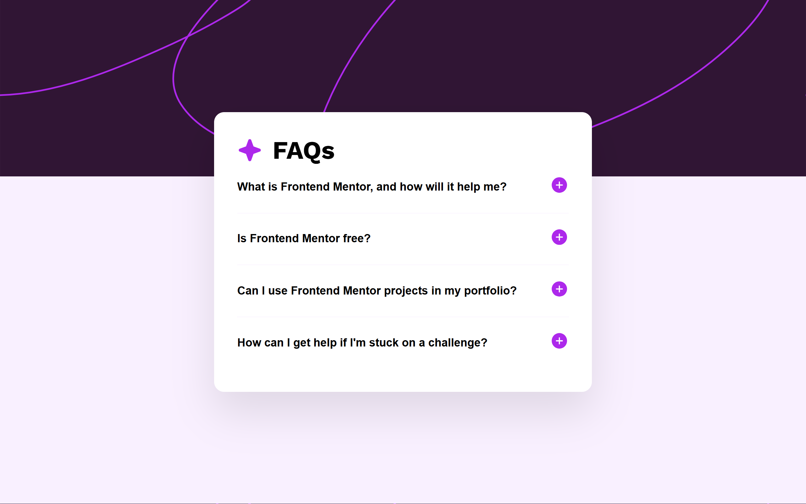

# Frontend Mentor - FAQ accordion solution

This is a solution to the [FAQ accordion challenge on Frontend Mentor](https://www.frontendmentor.io/challenges/faq-accordion-wyfFdeBwBz). Frontend Mentor challenges help you improve your coding skills by building realistic projects. 

## Table of contents

- [Overview](#overview)
  - [The challenge](#the-challenge)
  - [Screenshot](#screenshot)
  - [Links](#links)
- [My process](#my-process)
  - [Built with](#built-with)
- [Author](#author)

## Overview

  ### The challenge

  Users should be able to:

  - Hide/Show the answer to a question when the question is clicked
  - Navigate the questions and hide/show answers using keyboard navigation alone
  - View the optimal layout for the interface depending on their device's screen size
  - See hover and focus states for all interactive elements on the page

### Screenshot

### Links

- Solution URL: [Vercel](https://faq-accordion-main-sandy-six.vercel.app/)
- Live Site URL: [mmalabugin.ru/FAQAccordion/](https://mmalabugin.ru/FAQAccordion/)

### Built with

- Semantic HTML5 markup
- CSS custom properties
- Flexbox

## Author

- Website - [mmalabugin.ru](https://mmalabugin.ru/)
- Frontend Mentor - [@1t1sCooL](https://www.frontendmentor.io/profile/1t1sCooL)
- Twitter - [@vi_el_mar](https://www.twitter.com/vi_el_mar)
- Telegram - [@ItIsCooL](https://t.me/ItIsCooL)

